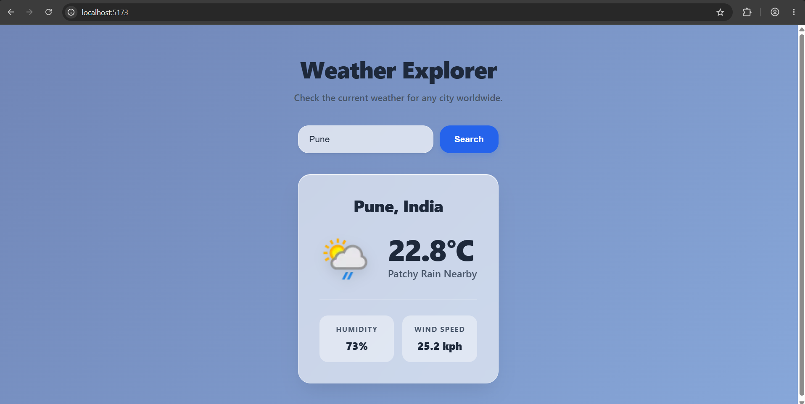
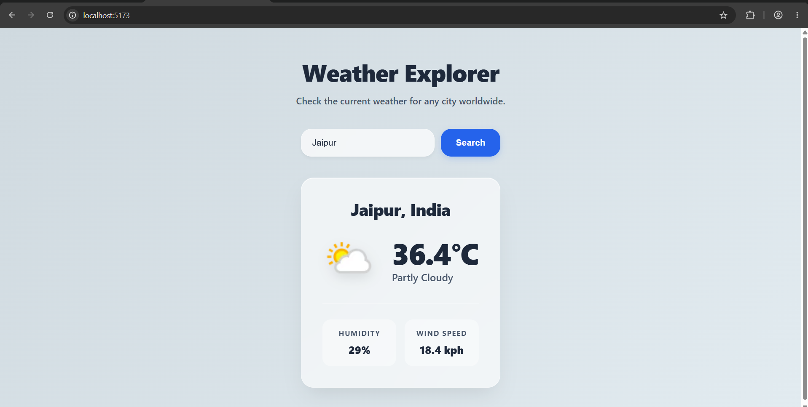
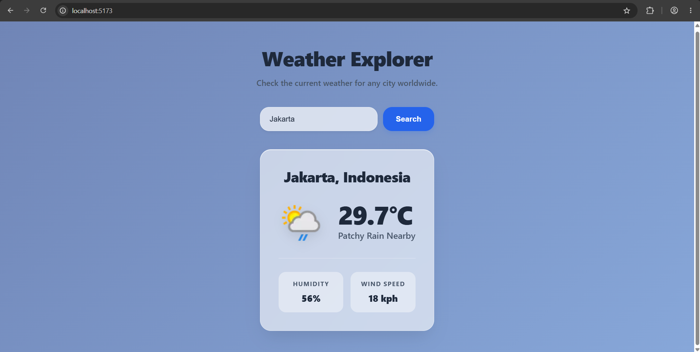

# Weather API Application

## Overview

This is a full-stack weather application built with React on the frontend and Node.js/Express on the backend. The application allows users to search for a city worldwide and instantly view the current weather conditions, temperature, humidity, and wind speed.

The backend acts as a secure proxy to protect the API key while simultaneously transforming complex third-party data into a clean, predictable format for the frontend.

### Basic Application Flow:

```text
User enters a city
        ↓
React frontend
        ↓
Express backend
        ↓
WeatherAPI.com
        ↓
Backend formats response
        ↓
React displays weather information
```

## Features

*   **Dynamic Visual Themes**: The application UI seamlessly crossfades between custom atmospheric gradients (e.g., sunny, rainy, stormy, snowy) based on the returned weather condition and temperature.
*   **Premium Glassmorphism Design**: A polished, responsive interface utilizing frosted glass (`backdrop-filter`) cards and components, styled entirely with vanilla CSS.
*   **Robust Error Handling**: Gracefully catches and displays specific errors for missing input, invalid cities (404), and server/network outages (500) without crashing the UI.
*   **Secure API Proxy**: The external WeatherAPI.com key is safely stored on the Express backend, never exposing secrets to the browser.
*   **Graceful Fallbacks**: Uses strict nullish coalescing to safely render missing API data points while properly displaying legitimate `0` values.

## Tech Stack

**Frontend (`/client`)**
*   React (initialized via Vite)
*   Vanilla CSS (Flexbox, CSS Grid, Custom Properties)

**Backend (`/server`)**
*   Node.js
*   Express.js (Routing and Middleware)
*   `cors` (Cross-Origin Resource Sharing)
*   `dotenv` (Environment Variable Management)
*   Native Node `fetch` API

---

## Local Setup Instructions

To run this project locally, you will need to start both the Express backend and the React frontend simultaneously in two separate terminal windows.

### Prerequisites
*   Node.js (v18 or higher recommended for native `fetch` support)
*   A free API key from [WeatherAPI.com](https://www.weatherapi.com/)

### 1. Backend Setup

Open a terminal and navigate to the `server` directory:

```bash
cd server
```

Install the dependencies:

```bash
npm install
```

Configure your environment variables:
1. Duplicate the `.env.example` file and rename it to `.env`.
2. Open the new `.env` file and replace `your_weatherapi_key_here` with your actual WeatherAPI key.

Start the backend server:

```bash
npm run dev
```
*(The server will start on `http://localhost:5000`)*

### 2. Frontend Setup

Open a **new** terminal window and navigate to the `client` directory:

```bash
cd client
```

Install the dependencies:

```bash
npm install
```

Start the Vite development server:

```bash
npm run dev
```
*(The React application will start on `http://localhost:5173`)*

---

## API Contract

The frontend communicates with the backend via the following endpoint:

**GET** `/api/weather?city={cityName}`

**Success Response (200 OK)**
```json
{
  "location": "London, United Kingdom",
  "temperature": 15,
  "condition": "Partly cloudy",
  "icon": "//cdn.weatherapi.com/weather/64x64/day/116.png",
  "humidity": 72,
  "wind_kph": 11.2
}
```

**Error Responses**
*   `400 Bad Request`: Returned immediately if the city query parameter is empty.
*   `404 Not Found`: Returned if WeatherAPI confirms the location does not exist.
*   `500/502 Server Error`: Returned generically for invalid API keys or network outages to prevent leaking internal details.


## Screenshots

The application adapts its interface based on the weather data returned for different locations.

### Pune



### London



### New York


